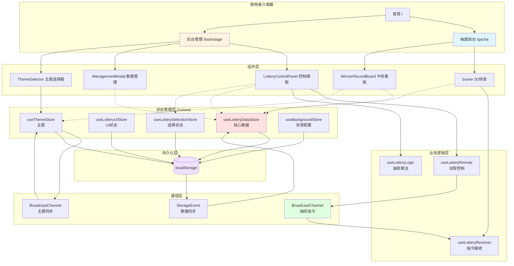
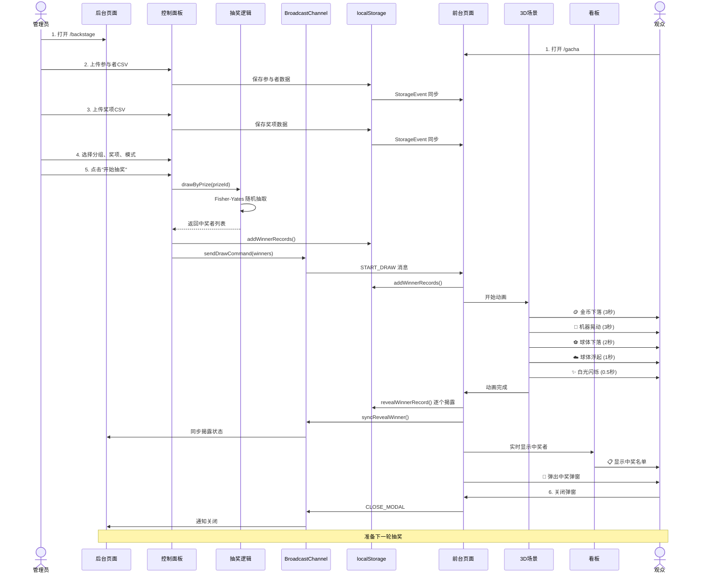
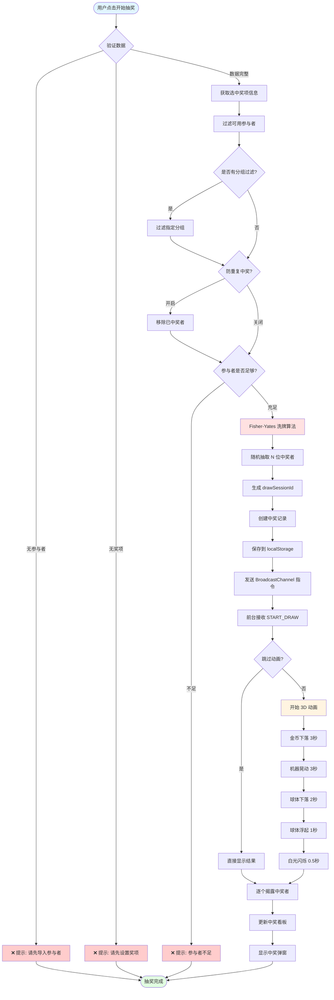
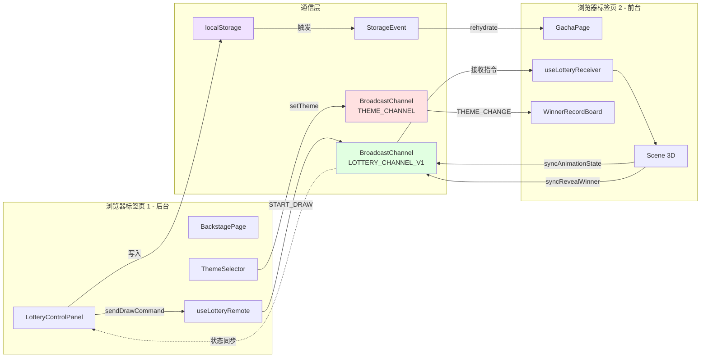
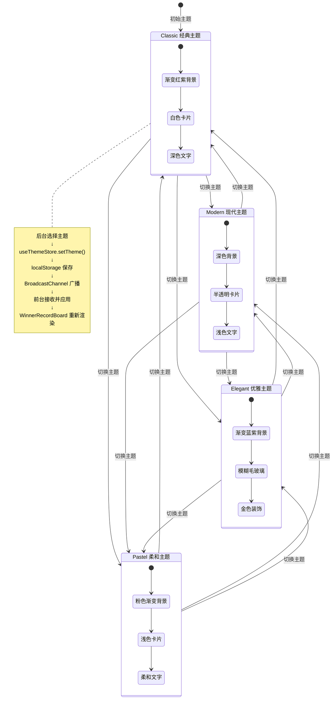

# KFSYSCC 抽獎系統 - 架構文件

> 本文件詳細說明了 KFSYSCC 2026 抽獎系統的完整架構、使用流程和技術實現

## 目錄

- [1. 整體系統架構](#1-整體系統架構)
- [2. 完整使用流程](#2-完整使用流程)
- [3. 抽獎核心流程](#3-抽獎核心流程)
- [4. 跨分頁通訊機制](#4-跨分頁通訊機制)
- [5. 資料管理流程](#5-資料管理流程)
- [6. 主題系統流程](#6-主題系統流程)
- [7. 核心技術棧](#7-核心技術棧)
- [8. 目錄結構](#8-目錄結構)
- [9. 狀態管理詳解](#9-狀態管理詳解)

---

## 1. 整體系統架構



### 架构说明

系统采用**分层架构设计**，从上到下分为：

1. **使用者介面層**: 三个主要页面（首頁、前台、后台）
2. **组件层**: 可复用的 React 组件
3. **状态管理层**: 5个独立的 Zustand Store
4. **业务逻辑层**: 自定义 Hooks 封装核心逻辑
5. **通信层**: 跨标签页通信机制
6. **持久化层**: localStorage 数据存储

---

## 2. 完整使用流程



### 流程说明

#### 阶段 1: 准备阶段
- **管理员**: 打开后台管理页面
- **观众**: 打开前台展示页面（投影到大屏幕）
- **数据导入**: 上传参与者和奖项 CSV 文件
- **数据同步**: localStorage 自动同步到所有标签页

#### 阶段 2: 抽奖阶段
- **选择参数**: 选择分组、奖项、抽奖模式
- **执行抽奖**: Fisher-Yates 算法随机抽取
- **指令广播**: BroadcastChannel 发送 START_DRAW 指令
- **3D动画**: 前台执行完整动画序列（约10秒）

#### 阶段 3: 公布阶段
- **逐个揭露**: 每秒揭露一位中奖者
- **看板显示**: 实时更新中奖看板
- **弹窗展示**: 显示完整中奖名单
- **状态同步**: 所有状态同步回后台

---

## 3. 抽奖核心流程



### Fisher-Yates 洗牌算法

```typescript
// 位置: src/hooks/useLotteryLogic.ts
function fisherYatesShuffle<T>(array: T[]): T[] {
  const shuffled = [...array];
  for (let i = shuffled.length - 1; i > 0; i--) {
    const j = Math.floor(Math.random() * (i + 1));
    [shuffled[i], shuffled[j]] = [shuffled[j], shuffled[i]];
  }
  return shuffled;
}
```

**算法特点**:
- **时间复杂度**: O(n)
- **公平性**: 每位参与者中奖概率完全相等
- **随机性**: 使用 Math.random() 生成真实随机数

---

## 4. 跨标签页通信机制



### 通信机制详解

#### 1. BroadcastChannel - 抽奖指令 (LOTTERY_CHANNEL_V1)

**发送方**: `src/hooks/useLotteryRemote.ts`

```typescript
// 支持的消息类型
type MessageType =
  | 'START_DRAW'           // 开始抽奖
  | 'SYNC_ANIMATION'       // 同步动画状态
  | 'SYNC_ANNOUNCING'      // 同步公布状态
  | 'SYNC_WINNER_MODAL'    // 同步弹窗状态
  | 'REVEAL_WINNER'        // 揭露中奖者
  | 'RESET_ANIMATION'      // 重置动画
  | 'CLOSE_MODAL'          // 关闭弹窗
  | 'TOGGLE_WINNER_BOARD'  // 切换看板显示
```

**接收方**: `src/hooks/useLotteryReceiver.ts`

#### 2. BroadcastChannel - 主题同步 (THEME_CHANNEL)

**用途**: 实时同步主题变更到所有标签页

**流程**:
```
后台 ThemeSelector → setTheme() → BroadcastChannel
→ 前台 useThemeSync() → 更新 Store → WinnerRecordBoard 重新渲染
```

#### 3. StorageEvent - 数据同步

**监听的 localStorage keys**:
- `kfsyscc-lottery-storage` - 核心数据
- `lottery-selection` - 选择状态
- `background-config` - 背景配置
- `lottery-ui` - UI 状态
- `lottery-theme-storage` - 主题

**实现**: `src/hooks/useStorageSync.ts`

---

## 5. 数据管理流程

```mermaid
flowchart TD
    Start([打开数据管理]) --> ManagementModal[ManagementModal 组件]

    ManagementModal --> Tab{选择功能}

    Tab -->|参与者| ParticipantTab[参与者管理]
    Tab -->|奖项| PrizeTab[奖项管理]
    Tab -->|设置| SettingsTab[全局设置]
    Tab -->|记录| RecordsTab[中奖记录]

    ParticipantTab --> UploadCSV1[上传 CSV]
    UploadCSV1 --> ParseCSV1[解析: 姓名,工号,部门,分组]
    ParseCSV1 --> ValidateData1{验证数据}
    ValidateData1 -->|格式错误| Error1[显示错误提示]
    ValidateData1 -->|正确| SaveParticipants[setParticipants]
    SaveParticipants --> LocalStorage1[(localStorage)]

    ParticipantTab --> ManualEdit1[手动编辑]
    ManualEdit1 --> AddParticipant[addParticipant]
    ManualEdit1 --> RemoveParticipant[removeParticipant]
    AddParticipant --> LocalStorage1
    RemoveParticipant --> LocalStorage1

    PrizeTab --> UploadCSV2[上传 CSV]
    UploadCSV2 --> ParseCSV2[解析: 名称,数量,颜色,分组]
    ParseCSV2 --> ValidateData2{验证数据}
    ValidateData2 -->|格式错误| Error2[显示错误提示]
    ValidateData2 -->|正确| SavePrizes[setPrizes]
    SavePrizes --> LocalStorage2[(localStorage)]

    PrizeTab --> ManualEdit2[手动编辑]
    ManualEdit2 --> UpdatePrize[updatePrize]
    ManualEdit2 --> RemovePrize[removePrize 软删除]
    UpdatePrize --> LocalStorage2
    RemovePrize --> LocalStorage2

    SettingsTab --> Toggle1[防重复中奖开关]
    SettingsTab --> Toggle2[跳过动画开关]
    Toggle1 --> LocalStorage3[(localStorage)]
    Toggle2 --> LocalStorage3

    RecordsTab --> ViewRecords[查看中奖记录]
    RecordsTab --> ExportRecords[导出 JSON]
    ViewRecords --> DisplayList[显示列表<br/>姓名 | 奖项 | 时间]
    ExportRecords --> DownloadJSON[下载备份文件]

    LocalStorage1 --> Sync[StorageEvent 跨标签页同步]
    LocalStorage2 --> Sync
    LocalStorage3 --> Sync
    Sync --> OtherTabs[其他标签页自动更新]

    style Start fill:#e1f5ff
    style LocalStorage1 fill:#f0e1ff
    style LocalStorage2 fill:#f0e1ff
    style LocalStorage3 fill:#f0e1ff
    style Sync fill:#e1ffe1
```

### CSV 文件格式

#### 参与者 CSV 格式
```csv
姓名,员工编号,部门,分组
张三,E001,技术部,VIP
李四,E002,市场部,普通
王五,E003,技术部,VIP
```

#### 奖项 CSV 格式
```csv
奖项名称,数量,球体颜色,分组
特等奖,1,gold,VIP
一等奖,3,red,
二等奖,5,blue,
```

---

## 6. 主题系统流程



### 主题文件位置

- `src/styles/themes/classic.module.css`
- `src/styles/themes/modern.module.css`
- `src/styles/themes/elegant.module.css`
- `src/styles/themes/pastel.module.css`

### 主题特点对比

| 主题 | 背景 | 卡片样式 | 文字颜色 | 装饰 |
|------|------|----------|----------|------|
| Classic | 红紫渐变 | 白色实心 | 深色 | 传统 |
| Modern | 深色背景 | 半透明 | 浅色 | 简约 |
| Elegant | 蓝紫渐变 | 毛玻璃 | 深色/金色 | 华丽 |
| Pastel | 粉色渐变 | 浅色柔和 | 柔和色 | 温馨 |

---

## 7. 核心技术栈

### 前端框架
- **Next.js**: 16.1.0 (App Router)
- **React**: 19.0.0
- **TypeScript**: 5.7.2

### 3D 渲染
- **Three.js**: 0.182.0
- **@react-three/fiber**: 9.0.0-beta.10
- **@react-three/drei**: 9.120.5
- **@react-three/rapier**: 2.0.6 (物理引擎)

### 状态管理
- **Zustand**: 5.0.9
  - persist 中间件用于 localStorage 持久化

### 样式
- **Tailwind CSS**: 3.4.1
- **CSS Modules** (主题系统)

### 工具库
- **nanoid**: 5.0.9 (生成唯一 ID)
- **canvas-confetti**: 1.9.4 (庆祝动画)

### 开发工具
- **pnpm**: 包管理器
- **ESLint**: 代码检查
- **React Compiler**: 自动性能优化

---

## 8. 目录结构

```
src/
├── app/                          # Next.js App Router
│   ├── page.tsx                 # 首頁（欢迎界面）
│   ├── gacha/
│   │   └── page.tsx             # 抽獎前台页面（3D场景）
│   ├── backstage/
│   │   └── page.tsx             # 抽奖后台管理页面
│   ├── layout.tsx               # 根布局
│   └── globals.css              # 全局样式
│
├── components/                   # React 组件库
│   ├── Scene.tsx                # 3D 场景主组件
│   ├── GachaMachine.tsx          # 扭蛋机 3D 模型
│   ├── GachaBall.tsx            # 扭蛋球物理组件
│   ├── WinnerModal.tsx          # 中奖弹窗
│   ├── WinnerRecordBoard.tsx    # 中奖记录看板（主题化）
│   ├── LotteryControlPanel.tsx  # 后台控制面板
│   ├── ManagementModal.tsx      # 数据管理模态框
│   ├── ThemeSelector.tsx        # 主题选择器
│   ├── FloatingBackgroundPanel.tsx  # 背景设置面板
│   └── ui/                      # UI 基础组件
│       ├── dialog.tsx
│       ├── button.tsx
│       └── ...
│
├── stores/                       # Zustand 状态管理
│   ├── useLotteryDataStore.ts   # 抽奖数据存储
│   ├── useLotteryUIStore.ts     # UI 状态存储
│   ├── useLotterySelectionStore.ts  # 选择状态
│   ├── useThemeStore.ts         # 主题状态
│   └── useBackgroundStore.ts    # 背景配置存储
│
├── hooks/                        # 自定义 React Hooks
│   ├── useLotteryLogic.ts       # 抽奖逻辑（Fisher-Yates）
│   ├── useLotteryRemote.ts      # 远程控制（广播发送）
│   ├── useLotteryReceiver.ts    # 接收器（广播接收）
│   ├── useStorageSync.ts        # localStorage 同步
│   ├── useThemeSync.ts          # 主题同步
│   └── usePreventClose.ts       # 防止抽奖中关闭页面
│
├── types/                        # TypeScript 类型定义
│   └── lottery.ts               # 抽奖相关类型
│
├── utils/                        # 工具函数
│   ├── lotteryChannel.ts        # BroadcastChannel 管理
│   ├── themeChannel.ts          # 主题 BroadcastChannel
│   └── imageStorage.ts          # 背景图片存储
│
├── config/                       # 配置文件
│   └── gachaConfig.ts           # 扭蛋机配置常量
│
└── styles/                       # 样式文件
    └── themes/                  # 主题样式
        ├── classic.module.css
        ├── modern.module.css
        ├── elegant.module.css
        └── pastel.module.css
```

---

## 9. 状态管理详解

### useLotteryDataStore (核心数据)

**文件**: `src/stores/useLotteryDataStore.ts:1`

**持久化数据**:
```typescript
{
  skipWinners: boolean;              // 防重复中奖开关
  skipAnimation: boolean;            // 跳过动画开关
  winnerRecords: WinnerRecord[];     // 中奖记录列表
  participants: Participant[];       // 参与者列表
  prizes: Prize[];                   // 奖项列表
}
```

**非持久化状态**:
```typescript
{
  isAnimating: boolean;              // 动画中
  isAnnouncingResults: boolean;      // 公布结果中
  showWinnerModal: boolean;          // 显示中奖弹窗
  currentDrawSessionId: string;      // 当前抽奖轮次 ID
}
```

**核心方法**:
- `addWinnerRecord()` - 添加单条中奖记录
- `addWinnerRecords()` - 批量添加中奖记录
- `revealWinnerRecord()` - 揭露特定记录
- `clearWinnerRecords()` - 清除所有记录
- `setParticipants()` - 设置参与者列表
- `setPrizes()` - 设置奖项列表
- `updatePrize()` - 更新奖项
- `removePrize()` - 软删除奖项

### useLotteryUIStore (UI 状态)

**文件**: `src/stores/useLotteryUIStore.ts:1`

```typescript
{
  showManagement: boolean;      // 显示管理模态框
  showBgPanel: boolean;         // 显示背景设置面板（持久化）
  showWinnerBoard: boolean;     // 显示中奖看板（持久化）
  loading: boolean;             // 加载中
  progress: number;             // 进度值
  sceneReady: boolean;          // 3D场景就绪
}
```

### useLotterySelectionStore (选择状态)

**文件**: `src/stores/useLotterySelectionStore.ts:1`

```typescript
{
  selectedPrizeId: string;      // 选中的奖项 ID
  selectedGroup: string;        // 选中的分组
  drawMode: 'single' | 'all';   // 抽奖模式
}
```

### useThemeStore (主题)

**文件**: `src/stores/useThemeStore.ts:1`

```typescript
{
  currentTheme: 'classic' | 'modern' | 'elegant' | 'pastel';
}
```

### useBackgroundStore (背景配置)

**文件**: `src/stores/useBackgroundStore.ts:1`

```typescript
{
  config: {
    positionX: number;          // 背景 X 坐标
    positionY: number;          // 背景 Y 坐标
    positionZ: number;          // 背景 Z 坐标
    scale: number;              // 背景缩放
  };
  selectedBackground: string;   // 选中的背景名称
  imageRefreshKey: number;      // 用于刷新背景图片
}
```

---

## 关键文件索引

### 页面组件
- 首頁: `src/app/page.tsx:1`
- 抽獎前台: `src/app/gacha/page.tsx:1`
- 后台管理: `src/app/backstage/page.tsx:1`

### 核心组件
- 3D 场景: `src/components/Scene.tsx:1`
- 扭蛋机: `src/components/GachaMachine.tsx:1`
- 控制面板: `src/components/LotteryControlPanel.tsx:47`
- 中奖看板: `src/components/WinnerRecordBoard.tsx:1`
- 中奖弹窗: `src/components/WinnerModal.tsx:1`

### 业务逻辑
- 抽奖算法: `src/hooks/useLotteryLogic.ts:1`
- 远程控制: `src/hooks/useLotteryRemote.ts:1`
- 指令接收: `src/hooks/useLotteryReceiver.ts:1`

### 通信机制
- 抽奖频道: `src/utils/lotteryChannel.ts:1`
- 主题频道: `src/utils/themeChannel.ts:1`
- 存储同步: `src/hooks/useStorageSync.ts:1`

---

## 性能优化

1. **React Compiler** - 自动 memoization，减少不必要的重渲染
2. **Zustand 精细订阅** - 组件只订阅需要的状态切片
3. **localStorage 持久化** - 快速数据恢复
4. **BroadcastChannel** - 高效跨标签页通信，避免轮询
5. **Fisher-Yates O(n)** - 线性时间复杂度的抽奖算法
6. **3D 模型预加载** - 提前加载扭蛋机模型
7. **CSS Modules** - 主题样式隔离，避免冲突

---

## 扩展性设计

### 易于扩展的功能点

1. **添加新主题**
   - 在 `src/styles/themes/` 新建 CSS 模块
   - 在 `useThemeStore.ts` 添加主题类型
   - 在 `WinnerRecordBoard.tsx` 导入新主题

2. **添加新奖项**
   - 直接在 UI 上传 CSV 即可
   - 支持自定义球体颜色、分组

3. **添加新参与者**
   - 支持 CSV 批量导入
   - 支持手动添加/编辑

4. **自定义 3D 动画**
   - 调整 `src/config/gachaConfig.ts`
   - 修改动画时长、缓动函数

5. **添加新的通信指令**
   - 在 `lotteryChannel.ts` 添加消息类型
   - 在 `useLotteryRemote.ts` 添加发送方法
   - 在 `useLotteryReceiver.ts` 添加接收处理

---

## 常见问题

### Q1: 如何重置所有数据？
**A**: 打开后台管理 → 数据管理 → 清除所有参与者、奖项和记录

### Q2: 抽奖动画卡顿怎么办？
**A**: 启用"跳过动画"选项，直接显示结果

### Q3: 如何防止重复中奖？
**A**: 在设置中启用"防重复中奖"开关

### Q4: 支持多少个参与者？
**A**: 理论上无限制，建议 10000 人以内以保证性能

### Q5: 如何导出中奖记录？
**A**: 后台管理 → 数据管理 → 记录 → 导出 JSON

---

## 技术亮点

1. **分离式架构**: 前台展示和后台控制完全分离
2. **实时同步**: 支持多标签页、多浏览器实时同步
3. **公平抽奖**: Fisher-Yates 算法保证绝对公平
4. **沉浸式体验**: Three.js 3D 动画 + 物理引擎
5. **主题系统**: 4 种预设主题，支持实时切换
6. **完整数据管理**: 导入、编辑、导出一站式解决
7. **防护机制**: 防止抽奖中关闭页面、数据丢失保护

---

## 开发者信息

**项目路径**: `/Users/qwe1593574268/Desktop/projects/kfsyscc_lottery_2026`

**启动命令**:
```bash
pnpm dev          # 开发模式 (http://localhost:3000)
pnpm build        # 生产构建
pnpm start        # 生产运行
```

**浏览器要求**:
- 支持 BroadcastChannel API (Chrome 54+, Firefox 38+)
- 支持 WebGL 2.0 (现代浏览器)
- 建议使用 Chrome 或 Edge 以获得最佳性能

---

**文档版本**: 1.0.0
**最后更新**: 2026-01-09
